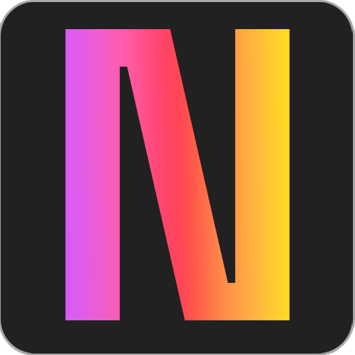

<p align="center">
  
</p>

<h1 align="center">Nōva</h1>

<p align="center">
  Tu workspace mínimo — notas, imágenes y tareas en un solo lugar.<br/>
  <strong>SPA</strong> &middot; <strong>Vanilla JS</strong> &middot; <strong>Firebase</strong> &middot; <strong>Zero dependencies</strong>
</p>

---

## ✨ Qué es

**Nōva** es una aplicación web minimalista tipo Notion, diseñada para organizar tu trabajo en tres secciones:

| Sección | Descripción |
|---------|-------------|
| 📝 **Notas** | Editor de texto rico con soporte para negrita, cursiva y listas. Layout masonry con tarjetas auto-savable. |
| 🖼️ **Imágenes** | Galería con grid masonry, modal de vista previa en tamaño original y edición de títulos. |
| ✅ **To-do** | Gestión de tareas con vista de tabla (default) y kanban con drag & drop nativo. |

Cada sección soporta **múltiples instancias** independientes — como historiales de herramientas de chat IA — para mantener todo separado y organizado.

## 🛠️ Stack

- **HTML / CSS / JavaScript** puro — sin frameworks, sin bundler
- **ES Modules** con importación directa desde CDN
- **Firebase Auth** para autenticación por email/password
- **Firestore** con listeners en tiempo real (`onSnapshot`)
- **GitHub Pages** como hosting estático

## 🚀 Deploy

El proyecto se sirve como archivos estáticos. Subilo a cualquier servidor o usá GitHub Pages:

```bash
# Clonar
git clone https://github.com/MozzVader/Nova.git
cd Nova

# Servir localmente (cualquier servidor estático)
npx serve .
# o
python3 -m http.server 8000
```

### Configurar Firebase

1. Creá un proyecto en [Firebase Console](https://console.firebase.google.com/)
2. Habilitá **Authentication > Email/Password**
3. Creá una base de datos **Firestore**
4. Copiá la config en `src/firebase/config.js`:

```js
const firebaseConfig = {
  apiKey: 'TU_API_KEY',
  authDomain: 'TU_PROYECTO.firebaseapp.com',
  projectId: 'TU_PROYECTO_ID'
};
```

5. Aplicá estas reglas de seguridad en Firestore:

```
rules_version = '2';
service cloud.firestore {
  match /databases/{database}/documents {
    match /instances/{doc} {
      allow read, write: if request.auth != null
                         && request.auth.uid == resource.data.userId;
      allow create: if request.auth != null
                    && request.auth.uid == request.resource.data.userId;
    }
  }
}
```

## 🎨 Características

- 🌙 **Dark / Light mode** con toggle integrado
- ⚡ **Tiempo real** — cambios sincronizados al instante vía Firestore
- 🔒 **Seguridad** — cada usuario solo accede a sus propios datos
- 📱 **Responsive** — funciona en desktop y mobile
- ✏️ **Renombrado en línea** — editá nombres directamente en el sidebar
- 🔄 **Undo toast** — deshacé eliminaciones con un click (15s de ventana)
- 🖱️ **Drag & drop** — mové tareas entre columnas en el kanban
- 🔗 **Hash routing** — URLs compartibles con estado de navegación

## 📁 Estructura

```
Nova/
├── index.html                  # App shell
├── assets/
│   ├── favicon.png             # Favicon 32×32
│   ├── apple-touch-icon.png    # iOS home screen 180×180
│   ├── icon-192.png            # PWA icon 192×192
│   └── icon-512.png            # PWA icon 512×512
└── src/
    ├── app.js                  # Estado global, routing y auth flow
    ├── firebase/
    │   ├── config.js           # Inicialización de Firebase
    │   └── db.js               # CRUD + auth helpers
    ├── components/
    │   ├── sidebar.js          # Navegación y lista de instancias
    │   ├── notes.js            # Editor de notas con contenteditable
    │   ├── images.js           # Galería de imágenes con masonry
    │   ├── todo.js             # Tabla + kanban con drag & drop
    │   └── toast.js            # Sistema de notificaciones undo
    └── styles/
        └── global.css          # Design system completo
```

## 📜 Licencia

Este proyecto está bajo la licencia **[CC BY-NC 4.0](https://creativecommons.org/licenses/by-nc/4.0/deed.es)**.

Podés compartir y adaptar este material siempre que des crédito al autor original y no lo utilices con fines comerciales.